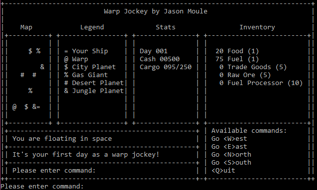

# WarpJockey
C++ console game

### Use included makefile for linux (executable is `FinalProject`)
### Or open and run in Visual Studio

## Created for final project in CS162 at Oregon State University
- Object Oriented Programming
- Polymorphism and inheritence 

## Game features
- 80x24 character design for old-school feels
- procedurally generated map
- multiple resource management
- skill-based obtainable (usually) goal
- tunable internal variables
